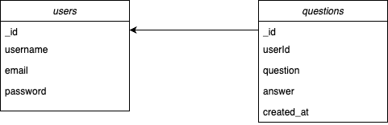
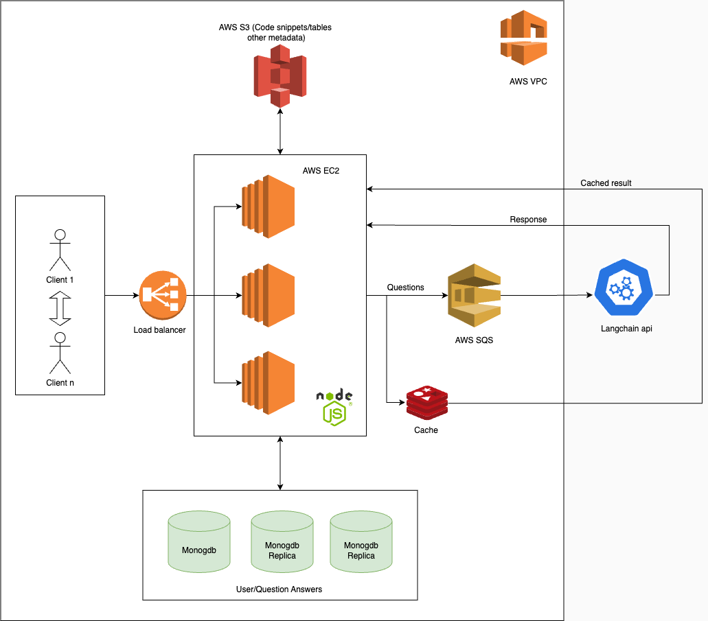

# Overview
A RESTful API that allows users to ask questions and receive AI-generated answers using the LangChain model integrated with the Anthropic language model. The service is built using Node.js, Express.js, and MongoDB, and includes features for JWT user authentication, question management and rate limiting.

# Features
User Authentication: Create and authenticate user accounts using JWT.  

**Question Management**: Users can post questions and retrieve answers generated by the AI. <br>
**Rate Limiting**: Prevent abuse of the API by limiting the number of requests per user.<br>
**Swagger** Documentation: Interactive API documentation using Swagger UI.<br>
**Logging**: Comprehensive logging with Winston.<br>

# Prerequisites

* Node.js and npm\
* MongoDB (local or cloud)\
* Docker (optional)

# Schema



# JWT Secret Key
```python
import secrets

# Generate a random secret key
secret_key = secrets.token_hex(32)
print("Secret Key:", secret_key)
```

# Anthropic API Key
https://console.anthropic.com/settings/keys

# Installation
Clone the repository:

```bash
git clone https://github.com/imsahil007/Sahil-AnswersAi-Backend.git
cd Sahil-AnswersAi-Backend
npm install
```

### Create a .env file in the directory and add the following:

```plaintext
PORT=3000
MONGODB_URI=mongodb://localhost:27017/aiservice
JWT_SECRET=your_jwt_secret
ANTHROPIC_API_KEY=your_anthropic_api_key
```

### Start server:

```bash
nodemon index.js
```
or
```bash
node index.js
```

Access Swagger UI:

Open your browser and navigate to http://localhost:3000/api-docs to view and interact with the API documentation.

## Docker
Build the Docker image:
```bash
docker build -t ai-service .
```
Run:
```bash
docker-compose up
```

## API Endpoints
Authentication
- `POST /api/auth/login`: User login.
- `POST /api/auth/logout`: User logout.
- `POST /api/auth/refresh`: Refresh JWT token.
Users
- `POST /api/users`: Create a new user.
- `GET /api/users/{userId:str}`: Get user profile.
Questions
- `POST /api/questions`: Create a new question.
- `GET /api/questions/{questionId:str}`: Get a specific question by ID.
- `GET /users/{userId:str}/questions`: Get all questions asked by a specific user.

### Running Tests
To run the tests using Jest:

```bash
npm run test
```


# Cloud



# Database Difference

| Feature                   | SQL (Relational)                                      | NoSQL (Non-relational)                                | Why NoSQL (MongoDB) for AI QA Service                 |
|---------------------------|------------------------------------------------------|------------------------------------------------------|------------------------------------------------------|
| **Schema**                | Predefined schemas                   | Schema-less, flexible                                 | Allows for flexible and evolving data models         |
| **Scalability**           | Vertical scaling(Horizaontal scaling is cumbersome)                                    | Horizontal scaling, easy to distribute data           | Handles large volumes of data and high traffic       |
| **Performance**           | Higher read/write throughput | Optimized for high read/write throughput              | Provides high read/write throughput |
| **Complex Queries**       | Supports complex join (FK)              | Limited support for complex joins                     | Simple relationships, no need for complex joins      |
| **Data Integrity**        | Strong data integrity with ACID properties           | Eventual consistency, flexible transactions           | Sufficient for application's needs                   |

**Reasons for Choosing NoSQL (MongoDB) for AI QA Service:**

1. **Flexible Schema**: Supports varying structures for questions and answers.
2. **Scalability**: Easily scales horizontally to manage millions of users.
3. **Performance**: High read/write throughput for real-time responses.
4. **Ease of Use**: Rapid development with a JSON-like document structure.
5. **Simple Relationships**: No need for complex joins, suitable for embedding/referencing documents.
